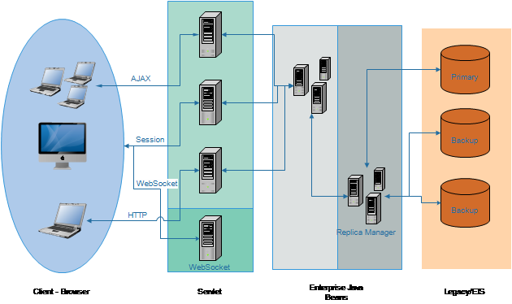
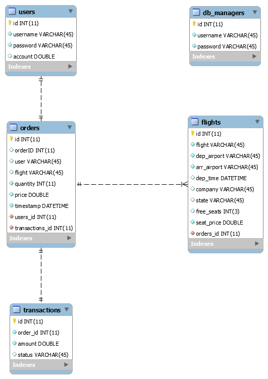
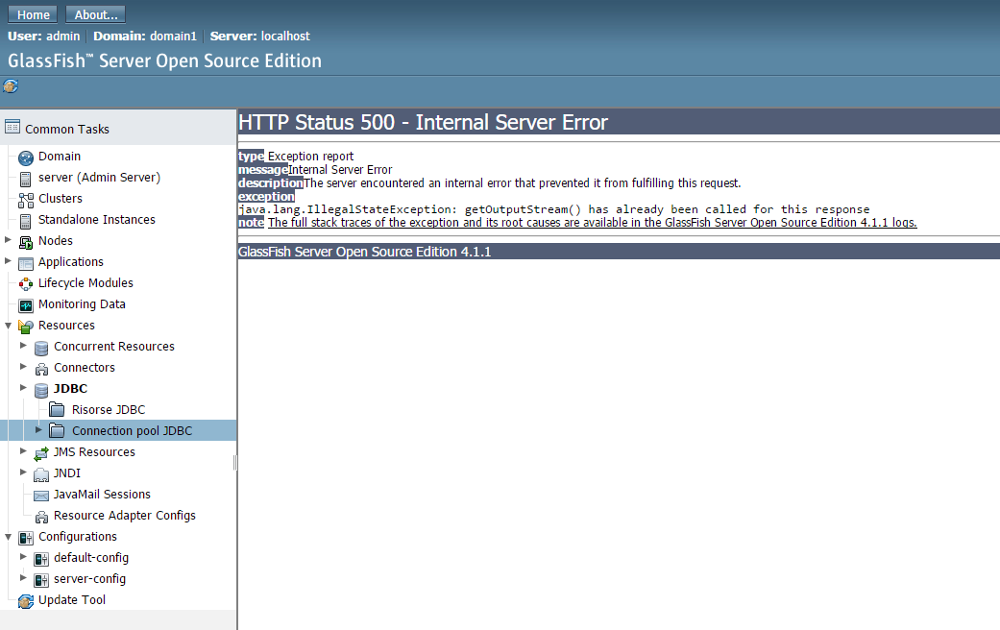
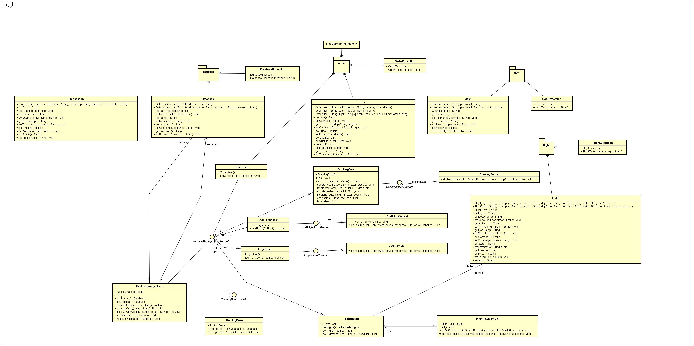

# FlyPortal

##Client
Il client è un comunissimo browser web (Chrome, Firefox, Safari, ...)

## Front-End
###JSP
Permette di scrivere codice serverside e di iniettarlo direttamente nel codice html.
Inoltre è possibile invocare direttamente bean e includere il risultato della loro chiamata
nel contesto della pagina come attributo.
###  Servlet
Sono organizzate secondo la loro funzionalità, ogni servlet ha uno specifico compito rendendole estremamente semplici.
Alcune servlet permettono la gestione dei form tramite metodo post (es. _RegistrationServlet_), altre hanno in incarico la gestione delle richeste __AJAX__
(es. _DeleteFlightServlet_).
Hanno anche la responsabilità di creare e gestire le __session__
 
__Scalabilita__: Le servlet così strutturate possono essere deployate in qualsiasi sistema rispondendo alle richieste sempre allo stesso modo.

###Session
Permettono di mantenere informazioni sullo stato della sessione client-server in corso. La sessione viene creata al momento del _login_:

* __auth__: permette di distinguere il livello di autorizzazione (user | admin)

* __username__: nome utente

* __cart__:	struttura dati di tipo _TreeMap_ che permette di memorizzare i voli prenotati dall'utente. La struttura dati è organizzate in modo 
da memorizzare il codice del volo di tipo stringa e il numero di posti prenotati, non è infatti necessario dover inserire all'interno del carrello
(e quindi della sessione) le informazioni complete sul volo in quanto possono essere ricavate al momento del bisogno utilizzando il codice (chiave).
In questo modo si alleggerisce parecchio la sessione e di conseguenza i messaggi in transito sulla rete.

###Pages

__Login__

Chi accede al sito può scegliere se loggarsi come db_manager o come user ma ci si può registrare solo come user.

__Visitors__

Nella pagina __Visitors__ accessible solo ai db_manager si è utilizzato un meccanismo simile al __CounterBean__ ma esteso in modo che fosse possibile non solo tenere traccia degli accessi all'applicazione
con informazioni relative a indirizzi ip e timestamp dell'ultimo accesso.

__Flights__

La pagina di visualizzazione dei voli disponibili è stata differenziata per autorizzazione in modo da consentire ai db_manager di modificare
ed eliminare i voli e agli utenti solo la visualizzazione e la prenotazione.

__Transactions__

Solo i db_manager hanno accesso alla pagina delle transazioni dove è possibile visualizzare tutte le transazioni effettuate con relative informazioni.

###WebService
Per recuperare informazioni su aeroporti e compagnie disponibili si è realizzato un web service che espone 2 metodi i quali forniscono la lista degli aeroporti (con relative informazioni)
e la lista delle compagnie aeree. Nel war è stato implementato il client di tale servizio che richiama i metodi attraverso una servlet (__FlightDataServlet__).

##Back-End
###Database
Si tratta di un pool di database mysql composto da un primary e uno slave secondo una configurazione
di gestione delle repliche passiva. Le query sono gestite dal primary ma è possibile
utilizzare il bean _routing_ per implementare un sistema di bilanciamento del carico tra le risorse.
Gli update vengono gestiti dal primary, un bean è dedicato all'aggiornamento delle replice e al loro
eventuale fault.

Tramite modifiche minime è possibile aggiungere, eliminare e modificare le risorse
dati a piacimento in modo da rispondere in maniera efficiente a un aumento delle richieste utente.

###Bean
Tutti i bean utilizzati sono stateless con interfaccaia remota in modo da ottimizzare scalabilità e migrabilità.
Per la gestione delle visite e delle risorse dati si sono utilizzati due bean di tipo singleton.
Un primo livello della logica di business ha il compito di creare
le query e ricevere le richeste dei client. Un livello aggiuntivo logicamente
collegato con i database eseguono le query ricevute dal livello precedente
e presentano i loro risultati.
Per gestire le transazione si è utilizzato un apposito bean (_BookingBeanRemote_) e permette
di con gestione di tipo _BEAN_ in modo da implementare il 2PC.

__Scalabilità e migrabilità:__ nessun bean mantiene in memoria informazioni sullo stato della connessione, possono scalare orizzontalmente secondo esigenza.
Le interfacce remote consentono ai client di utilizzare differenti versioni di _JVM_

###WebSocket
Si è utilizzato un server WebSocket con approccio publisher/subscriber: 
i subscriber aprono una nuova connessione verso il server WS (_FlyPortalWS_) restando in attesa di una notifica; 
i publisher si attiveranno non appena viene eseguita una modifica nei dati, verrà quindi inviato
un dummy message che notificherà i subscriber. Ricevuta la notify i client potranno
eseguire un refresh dell'elemento. 

###Bug

<https://java.net/jira/browse/GLASSFISH-21314>

A causa del bug riportato non è stato possibile gestire i database direttamente dal server glassfish.
Tuttavia è stato possibile una gestione esplicita delle risorse senza compromettere le qualità
di scalabilità.

##Class Diagram

##Test Application
Tramite queste credenziali è possibile loggarsi e utilizzare l'applicazione
* Accesso come db_manager
 __username__: stefano
 __password__: ciao
 
* Accesso come user
__username__: paperino
 __password__: paperino
